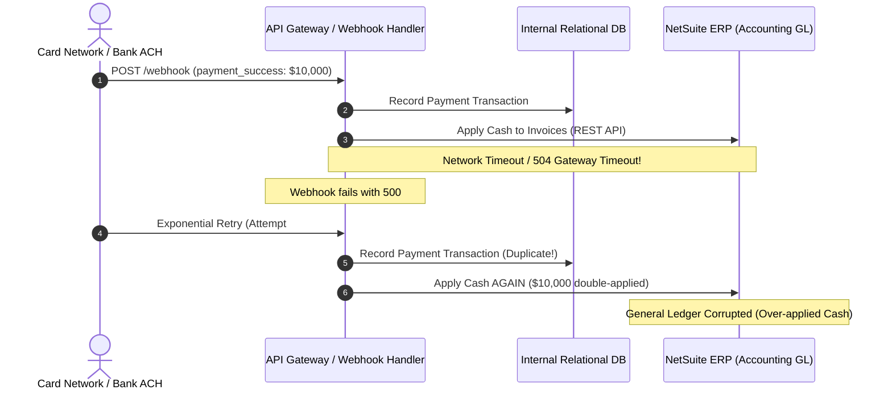
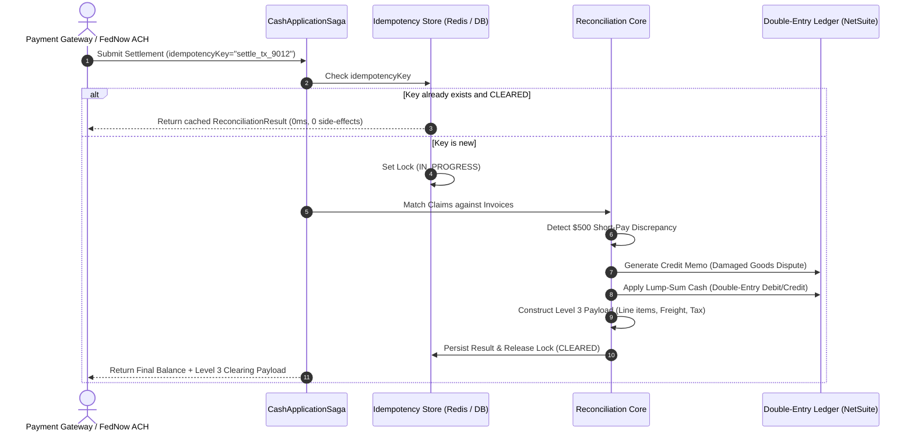

# Architectural Whitepaper: Naive Webhooks vs. Idempotent Sagas in B2B Wholesale Payment Settlement

**Author:** Jayson Quindao  
**Domain:** Fintech Infrastructure / B2B Broadline Food Distribution  
**Target Systems:** NetSuite ERP, QuickBooks Enterprise, Stripe / Finix Card Clearing Networks  

---

## Executive Summary

B2B food distributors operate on tight net margins (typically **1.5% to 3.0%**). Their cash application pipelines face two existential challenges:
1. **Ledger Drift & Double-Credit from Naive Webhooks:** Bank feeds and payment gateways deliver asynchronous events that are frequently re-tried over un-reliable network links. Naive HTTP webhook handlers corrupt General Ledgers by double-applying cash or generating un-matched floating receivables.
2. **Excess Interchange Drag:** Corporate purchasing cards process at standard Level 1 / Level 2 interchange tiers (**~2.85% to 2.95% + $0.30**), completely erasing distributor net profit margins unless itemized line items and commodity codes are injected for **Level 3 Interchange qualification (~1.60% to 1.80%)**.

This paper details why standard REST webhook architectures fail in wholesale distribution and demonstrates how an **Idempotent Saga State Machine** guarantees zero ledger drift and optimal interchange pricing.

---

## 1. Failure Modes of Naive Webhook Handlers

A standard webhook listener follows an optimistic linear flow:

### The 3 Fatal Bugs in Naive Settlement:
1. **At-Least-Once Delivery Guarantees:** Gateways (Stripe, Adyen, Finix, FedNow) guarantee *at-least-once* delivery, meaning duplicates are guaranteed to happen during network partitions.
2. **Partial State Application:** If an ERP network call times out after the payment is marked `CLEARED` in the distributor's database, the local balance and the ERP balance permanently decouple.
3. **Lump-Sum Discrepancy & Short-Pays:** When a restaurant remits $8,000 to settle three invoices totaling $8,500 due to $500 in damaged produce, a naive script errors out because `Sum(Claims) != Remittance`, leaving all invoices open and triggering manual collections calls.

---

## 2. The Solution: Distributed Idempotent Cash Application Saga

The **Freely Reconciliation Engine** implements an explicit 4-phase transaction saga with deterministic idempotency keys and compensating transactions.

### Mathematical Guarantees:
* **Strict Double-Entry Equilibrium:**
  $$\sum \text{Debits} = \sum \text{Credits}$$
  Every applied dollar corresponds to an exact debit against Cash and a corresponding credit against Accounts Receivable (A/R).
* **Deterministic Dispute Isolation:** Short-pay amounts never block clean invoice settlement. Undisputed amounts clear immediately; disputed line items are carved out into automated Credit Memos pending vendor approval.

---

## 3. Level 3 Interchange Optimization Economics

For wholesale food distributors, payment processing is often their second-largest operational expense after labor and fuel.

### Interchange Cost Breakdown on a $10,000 Invoice:

| Tier | Required Data Fields | Typical Interchange Rate | Processing Cost on $10k |
|---|---|---|---|
| **Level 1** | Card Number, Expiration, Zip | ~2.95% + $0.30 | **$295.30** |
| **Level 2** | Customer Code, Sales Tax | ~2.50% + $0.30 | **$250.30** |
| **Level 3 (Freely Engine)** | Itemized Quantities, Unit Prices, Product Codes, Tax ID, Freight Breakdown | **~1.65% + $0.20** | **$165.20** |

**Net Savings per $10,000 Transaction:** **$130.10 (44% fee reduction)**.

For a mid-sized distributor processing **$5,000,000 / month** in card payments, Level 3 qualification recovers **$65,050 / month ($780,600 / year)** directly to net operating income.

The `generateLevel3Payload()` module automatically extracts SKU-level line items from the matching invoices and formats them into ISO 8583 / card network clearing standards.

---

## 4. Verification & Stress Testing

The engine includes rigorous integration test suites (`__tests__/reconciliation.test.ts`) validating:
1. Multi-invoice lump-sum distribution with cent-perfect precision.
2. Short-pay dispute isolation without stalling parent invoice closure.
3. Zero side-effect idempotency on duplicate retry storms.
4. Level 3 payload syntax compliance.
5. Rejection of invalid remittance amounts where claims do not balance.
